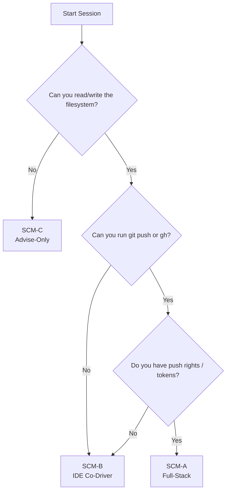

SCM Mode Decision Tree
======================

Intent
------

- Provide a quick checklist for agents to determine which Session Capability Mode (SCM) they are operating in.
- Clarify which operations are allowed per mode and when to pause for human confirmation.

Decision Flow
-------------

Mode Summary
------------

| Mode  | Allowed Operations                                                                 | Requires Confirmation                  |
| ----- | ----------------------------------------------------------------------------------- | -------------------------------------- |
| SCM-A | Create branches/PRs, push commits, run CI, create repos/projects, manage labels     | Repo creation, visibility changes, secrets updates |
| SCM-B | Local edits, diff generation, scripts/patches, documentation updates                | Any action that mutates remote state (ask human) |
| SCM-C | Advise-only packages (issue/plan/PR bodies, reviews, checklists, single-file diffs) | Any filesystem or git action; multi-file or automated changes |

Confirmation Checklist
----------------------

Before performing privileged operations (repo creation, branch protection, secret rotation):

1. State the intended action and confirm the mode.
2. Ask for explicit human approval if outside SCM-B boundaries.
3. Log the approval (issue/PR comment or chat transcript).

See Also
--------

- [Engineering Contract – Session Capability Modes](../../design/ENGINEERING_CONTRACT.md)
- [Session-Mode Handshake Capsule](https://github.com/pvliesdonk/ai_engineer_contract/blob/develop/ai/session-mode-handshake.md)
- [SCM-C Advise-Only Templates](./scm-c-advise.md)
